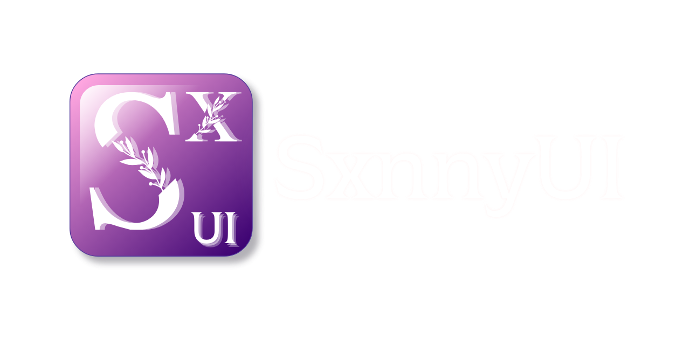

# SxnnyUI



SxnnyUI es un paquete de [Swift](https://www.swift.org/) que ofrece una variedad de componentes de interfaz de usuario (UI) preconfigurados para facilitar y agilizar el desarrollo de aplicaciones en iOS.
Actualmente es compatible con la funcionalidad de [SwiftUI](https://developer.apple.com/xcode/swiftui/).

## Características

- **Componentes Personalizables**: Amplia gama de elementos UI que se pueden adaptar a las necesidades específicas de tu aplicación.
- **Fácil Integración**: Diseñado para integrarse sin problemas en proyectos existentes.
- **Optimización de Rendimiento**: Componentes ligeros y eficientes para un rendimiento óptimo.

## Instalación

Para integrar SxnnyUI en tu proyecto, puedes utilizar [Swift Package Manager](https://swift.org/package-manager/). Añade la siguiente dependencia a tu archivo `Package.swift`:

```swift
dependencies: [
    .package(url: "https://github.com/Sxnnyside-Project/SxnnyUI.git", from: "1.0.0")
]
```

## Uso Básico

Importa el módulo SxnnyUI en tu archivo Swift:

```swift
  import SxnnyUI
```

A continuación, puedes utilizar los componentes proporcionados por SxnnyUI en tu aplicación:

```swift
  import SwiftUI

  struct ContentView: View {
      let multilinetext: String = "1\n2\n3"
      var body: some View {
          VStack {
              HStack {
                Spacer()
                FocusText("Versión 1.0")
              }
              Label(multilinetext, systemImage: "gear")
                .labelStyle(.centerAligned)
          }
          .padding()
      }
  }
```

## Contribuciones y Errores

Las contribuciones son bienvenidas. Si encuentras algun error o comportamiento no esperado, favor de avisarnos.
Se esta trabajando para que los componentes sean personalizables en su totalidad, actualmente [FocusText](Sources/SxnnyUI/Labels/FocusText.swift) es el comienzo pero los demas lo estaran pronto.

## Licencia

Este proyecto está licenciado bajo la Licencia MIT. Para más detalles, consulta el archivo LICENSE.
